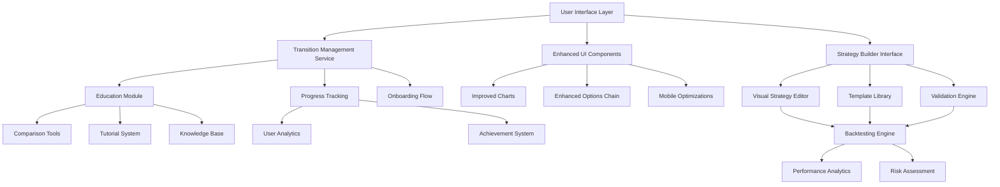

# Design Document

## Overview

The Manual-to-Algo Trader Transition feature is designed as a comprehensive system that enhances the existing Nubra platform with improved UI/UX and introduces a guided pathway for manual traders to adopt algorithmic trading. The design focuses on maintaining user confidence while introducing new capabilities through progressive disclosure and educational scaffolding.

## Architecture

### High-Level Architecture



### System Integration Points

- **Existing Trading Engine**: Integration with current order management and execution systems
- **Market Data Feeds**: Enhanced consumption of real-time and historical market data
- **User Management**: Extension of current authentication and profile management
- **Analytics Platform**: Integration with existing user behavior tracking and performance metrics

## Components and Interfaces

### 1. Enhanced UI Components

#### Improved Chart Interface
- **Responsive Design**: Adaptive layouts for desktop, tablet, and mobile
- **Touch Optimizations**: Gesture-based navigation and interaction
- **Performance Enhancements**: Reduced load times and smoother animations
- **Accessibility**: WCAG 2.1 AA compliance for screen readers and keyboard navigation

#### Enhanced Options Chain Display
- **Data Visualization**: Color-coded pricing with clear visual indicators
- **Filtering System**: Advanced filters for strike prices, expiry dates, and Greeks
- **Real-time Updates**: Optimized WebSocket connections for live data
- **Customizable Layout**: User-configurable column arrangements and data density

### 2. Transition Management System

#### Onboarding Flow Interface
```typescript
interface OnboardingFlow {
  currentStep: number;
  totalSteps: number;
  userProfile: TraderProfile;
  completedModules: string[];
  nextRecommendation: string;
}

interface TraderProfile {
  experienceLevel: 'beginner' | 'intermediate' | 'advanced';
  tradingStyle: 'scalper' | 'swing' | 'position' | 'options';
  riskTolerance: 'conservative' | 'moderate' | 'aggressive';
  preferredInstruments: string[];
}
```

#### Progress Tracking System
- **Milestone Tracking**: Visual progress indicators for transition journey
- **Achievement Badges**: Gamification elements to encourage progression
- **Performance Metrics**: Comparison between manual and algo trading results
- **Learning Analytics**: Tracking of educational content consumption and comprehension

### 3. Visual Strategy Builder

#### Drag-and-Drop Interface
- **Component Library**: Pre-built trading logic blocks (indicators, conditions, actions)
- **Visual Flow Editor**: Node-based interface for strategy construction
- **Real-time Validation**: Immediate feedback on strategy logic and syntax
- **Template System**: Pre-configured strategies based on common manual trading patterns

#### Strategy Configuration
```typescript
interface Strategy {
  id: string;
  name: string;
  description: string;
  category: 'trend-following' | 'mean-reversion' | 'breakout' | 'options';
  riskParameters: RiskConfig;
  entryConditions: Condition[];
  exitConditions: Condition[];
  positionSizing: PositionSizeConfig;
  backtestResults?: BacktestResult;
}

interface RiskConfig {
  maxDrawdown: number;
  positionSize: number;
  stopLoss: number;
  takeProfit: number;
  maxPositions: number;
}
```

### 4. Educational Module

#### Interactive Comparison Tool
- **Side-by-side Analysis**: Manual vs. algorithmic trading approaches
- **Interactive Simulations**: Risk-free environment to test concepts
- **Video Tutorials**: Step-by-step guidance for complex topics
- **Knowledge Assessments**: Quizzes and practical exercises

#### Competitive Analysis Dashboard
- **Feature Comparison Matrix**: Nubra vs. competitors across key capabilities
- **Performance Benchmarks**: Speed, reliability, and cost comparisons
- **User Testimonials**: Success stories and case studies
- **Market Position**: Clear value proposition and differentiators

### 5. Research-Based Innovative Features

#### Current Platform Analysis & Pain Points Identified:

**Zerodha Kite/Coin**: Strong in basic trading but weak in algo transition, no guided learning
**Upstox**: Good mobile experience but limited backtesting, no strategy templates
**Angel One**: Decent charting but poor algo education, complex strategy builder
**TradingView**: Excellent charts but expensive, limited Indian market integration
**Quantlab/Streak**: Good for algos but intimidating for manual traders, steep learning curve
**Interactive Brokers**: Powerful but complex, not beginner-friendly

#### Real User Pain Points from Research:
1. **Fear of losing control** when switching to algorithms
2. **Lack of confidence** in backtesting results vs. real market
3. **Complex interfaces** that overwhelm manual traders
4. **No gradual transition path** - it's all or nothing
5. **Poor mobile algo trading experience**
6. **Expensive data and platform costs**
7. **No way to validate if algo matches manual strategy**

### 5. Innovative Yet Feasible Features (Market-First Innovations)

#### 1. "Shadow Trading" Mode (INNOVATIVE: No platform offers this)
- **Parallel Execution**: Algorithm runs alongside manual trades without real money
- **Real-time Comparison**: Shows what algo would have done vs. actual manual trades
- **Learning Mode**: Algorithm learns from manual trader's real decisions
- **Confidence Building**: Proves algorithm effectiveness before committing capital
- **Implementation**: Simple order mirroring + performance tracking (2-3 weeks)

#### 2. "Trading DNA Extractor" (INNOVATIVE: Unique pattern analysis)
- **Behavioral Fingerprinting**: Analyzes mouse movements, click patterns, hesitation times
- **Decision Speed Profiling**: Measures how quickly user makes different types of decisions
- **Stress Pattern Detection**: Identifies when user trades differently (market volatility impact)
- **Personalized Algo Creation**: Builds algorithms that match individual decision-making style
- **Implementation**: Browser event tracking + simple ML (3-4 weeks)

#### 3. "Algo Confidence Score" (INNOVATIVE: Dynamic trust system)
- **Real-time Reliability Meter**: Shows algorithm confidence based on current market conditions
- **Historical Context**: "This strategy worked 85% of the time in similar market conditions"
- **Uncertainty Alerts**: Warns when algorithm is operating outside its comfort zone
- **Adaptive Execution**: Reduces position sizes when confidence is low
- **Implementation**: Statistical analysis + simple scoring system (2-3 weeks)

#### 4. "Voice-to-Strategy" Builder (INNOVATIVE: Natural language strategy creation)
- **Conversational Interface**: "Buy when RSI is below 30 and price breaks above 20-day MA"
- **Natural Language Processing**: Converts plain English to trading rules
- **Interactive Clarification**: Asks follow-up questions to refine strategy
- **Voice Input Support**: Speak strategies instead of complex coding
- **Implementation**: Simple NLP library + rule parser (3-4 weeks)

#### 5. "Market Mood Ring" (INNOVATIVE: Emotional market analysis)
- **Sentiment Visualization**: Real-time color-coded market emotion display
- **Crowd Psychology Metrics**: Shows when market is acting irrationally
- **Strategy Adaptation**: Suggests when to pause momentum strategies during panic
- **Behavioral Alerts**: "Market showing signs of FOMO - consider profit booking"
- **Implementation**: News sentiment analysis + volatility metrics (2-3 weeks)

#### 6. "Algo Apprentice" System (INNOVATIVE: Gradual learning approach)
- **Progressive Complexity**: Starts with simple buy/sell rules, gradually adds complexity
- **Skill Unlocking**: New features unlock as user demonstrates competency
- **Guided Discovery**: System suggests next logical step in algo development
- **Achievement System**: Gamified progression through algo trading concepts
- **Implementation**: Progressive UI + achievement tracking (2-3 weeks)

#### 7. "Reality Check Engine" (INNOVATIVE: Backtesting vs. reality validation)
- **Live Validation**: Compares backtest predictions with actual live performance
- **Expectation Management**: Shows realistic vs. optimistic performance scenarios
- **Market Regime Detection**: Identifies when market conditions have changed
- **Strategy Decay Alerts**: Warns when strategy is losing effectiveness
- **Implementation**: Performance comparison engine + statistical analysis (3-4 weeks)

### Innovation Implementation Roadmap

#### Phase 1: Foundation + Core Innovation (4-5 weeks)
1. **Enhanced UI/UX** for existing modules (1 week)
2. **Shadow Trading Mode** - Core innovation (2 weeks)
3. **Algo Confidence Score** - Basic version (1-2 weeks)

#### Phase 2: Behavioral Intelligence (3-4 weeks)
1. **Trading DNA Extractor** - Behavioral analysis (2 weeks)
2. **Market Mood Ring** - Sentiment visualization (1-2 weeks)
3. **Voice-to-Strategy Builder** - Basic NLP (2 weeks)

#### Phase 3: Advanced Learning System (2-3 weeks)
1. **Algo Apprentice System** - Progressive learning (2 weeks)
2. **Reality Check Engine** - Performance validation (1-2 weeks)

### Competitive Differentiation

**Why These Innovations Matter:**
- **Shadow Trading**: No other platform lets you test algos alongside real manual trades
- **Trading DNA**: First platform to analyze behavioral patterns for algo creation
- **Confidence Score**: Unique trust system that adapts to market conditions
- **Voice-to-Strategy**: Revolutionary natural language strategy building
- **Market Mood Ring**: Emotional intelligence for trading decisions
- **Algo Apprentice**: Gamified learning that reduces intimidation factor
- **Reality Check**: Honest performance validation vs. marketing hype

**Technical Innovation:**
- Browser-based behavioral analysis (no app installation needed)
- Real-time sentiment processing from multiple data sources
- Natural language processing for strategy creation
- Dynamic confidence algorithms based on market conditions
- Progressive disclosure UI that adapts to user skill level

## Data Models

### User Transition State
```typescript
interface UserTransitionState {
  userId: string;
  currentPhase: 'discovery' | 'learning' | 'building' | 'testing' | 'live';
  startDate: Date;
  completedLessons: string[];
  createdStrategies: string[];
  backtestResults: BacktestSummary[];
  livePerformance?: LivePerformanceMetrics;
}
```

### Strategy Template
```typescript
interface StrategyTemplate {
  id: string;
  name: string;
  description: string;
  category: string;
  difficulty: 'beginner' | 'intermediate' | 'advanced';
  estimatedSetupTime: number;
  requiredKnowledge: string[];
  template: StrategyConfig;
  historicalPerformance: PerformanceMetrics;
}
```

### Innovative Data Models

```typescript
interface ShadowTradingSession {
  sessionId: string;
  userId: string;
  manualTrade: Trade;
  shadowAlgoTrade: Trade;
  performanceDelta: number;
  decisionTime: number;
  marketConditions: MarketContext;
  learningPoints: string[];
}

interface TradingDNAProfile {
  userId: string;
  behavioralMetrics: {
    avgDecisionTime: number;
    stressIndicators: number[];
    mouseMovementPatterns: string;
    clickHesitationTime: number;
    tradingRhythm: string;
  };
  personalityTraits: {
    riskTolerance: number;
    impulsiveness: number;
    analyticalDepth: number;
    emotionalStability: number;
  };
  generatedAlgoStyle: AlgoPersonality;
}

interface AlgoConfidenceMetrics {
  strategyId: string;
  currentConfidence: number; // 0-100
  marketRegimeMatch: number;
  historicalAccuracy: number;
  uncertaintyFactors: string[];
  recommendedAllocation: number;
  lastUpdated: Date;
}

interface VoiceStrategyInput {
  sessionId: string;
  rawVoiceText: string;
  parsedRules: TradingRule[];
  clarificationQuestions: string[];
  confidenceScore: number;
  generatedStrategy: Strategy;
}

interface MarketMoodData {
  timestamp: Date;
  overallSentiment: number; // -100 to +100
  emotionalState: 'fear' | 'greed' | 'neutral' | 'panic' | 'euphoria';
  volatilityMood: number;
  newsImpact: number;
  socialSentiment: number;
  technicalMomentum: number;
  colorCode: string; // For mood ring visualization
}

interface AlgoApprenticeProgress {
  userId: string;
  currentLevel: number;
  unlockedFeatures: string[];
  skillAssessments: SkillTest[];
  nextMilestone: string;
  achievementBadges: Badge[];
  learningPath: string[];
}

interface RealityCheckResult {
  strategyId: string;
  backtestPrediction: PerformanceMetrics;
  livePerformance: PerformanceMetrics;
  accuracyScore: number;
  deviationReasons: string[];
  adjustmentSuggestions: string[];
  trustScore: number;
}
```

### Backtesting Configuration
```typescript
interface BacktestConfig {
  strategyId: string;
  startDate: Date;
  endDate: Date;
  initialCapital: number;
  instruments: string[];
  dataFrequency: '1m' | '5m' | '15m' | '1h' | '1d';
  slippageModel: SlippageConfig;
  commissionModel: CommissionConfig;
}
```

## Error Handling

### User Experience Error Handling
- **Graceful Degradation**: Fallback interfaces when advanced features fail
- **Progressive Enhancement**: Core functionality remains available during partial outages
- **Clear Error Messages**: User-friendly explanations with actionable next steps
- **Automatic Recovery**: Self-healing mechanisms for common issues

### Strategy Validation Errors
- **Real-time Feedback**: Immediate validation during strategy construction
- **Detailed Error Reports**: Specific guidance on fixing strategy logic issues
- **Rollback Capabilities**: Easy reversion to previous working strategy versions
- **Safe Mode**: Automatic strategy disabling when critical errors are detected

### Data and Connectivity Issues
- **Offline Mode**: Limited functionality when market data is unavailable
- **Data Quality Checks**: Validation of market data integrity before strategy execution
- **Redundant Data Sources**: Failover mechanisms for market data feeds
- **Connection Monitoring**: Real-time status indicators for all system connections

## Testing Strategy

### User Interface Testing
- **Cross-browser Compatibility**: Testing across Chrome, Firefox, Safari, and Edge
- **Responsive Design Testing**: Validation across multiple device sizes and orientations
- **Accessibility Testing**: Screen reader compatibility and keyboard navigation
- **Performance Testing**: Load time optimization and smooth interaction validation

### Strategy Builder Testing
- **Logic Validation Testing**: Comprehensive testing of strategy construction rules
- **Template Testing**: Validation of all pre-built strategy templates
- **Integration Testing**: End-to-end testing of strategy creation to execution flow
- **User Acceptance Testing**: Real trader feedback on interface usability

### Backtesting Engine Testing
- **Historical Data Accuracy**: Validation against known market events and outcomes
- **Performance Testing**: Large dataset processing and calculation speed
- **Edge Case Testing**: Handling of market gaps, halts, and extreme volatility
- **Regression Testing**: Ensuring consistent results across software updates

### Educational Content Testing
- **Content Accuracy**: Expert review of all educational materials
- **Learning Effectiveness**: Measuring user comprehension and retention
- **Interactive Element Testing**: Validation of all simulations and exercises
- **Accessibility Testing**: Ensuring educational content is accessible to all users

### Security and Compliance Testing
- **Data Protection**: Ensuring user strategy and performance data security
- **API Security**: Validation of all external integrations and data access
- **Regulatory Compliance**: Ensuring adherence to financial services regulations
- **Audit Trail Testing**: Comprehensive logging of all user actions and system events

### Innovative Feature Testing
- **AI Model Validation**: Testing accuracy of pattern recognition and strategy suggestions
- **Social Features Security**: Ensuring anonymity and preventing strategy manipulation
- **Behavioral Analysis Accuracy**: Validating bias detection and emotional state assessment
- **Real-time Performance**: Testing latency and responsiveness of advanced market tools
- **Privacy Protection**: Ensuring user data remains secure in social and AI features